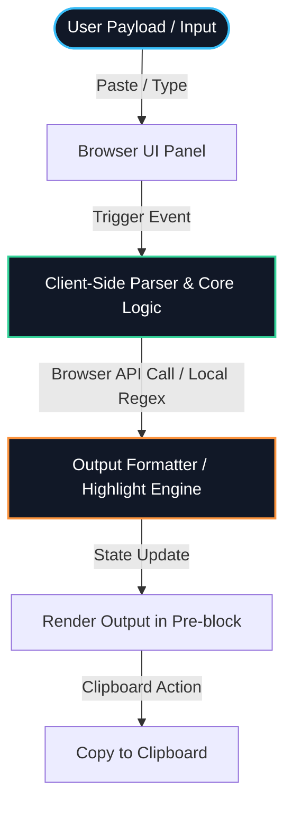
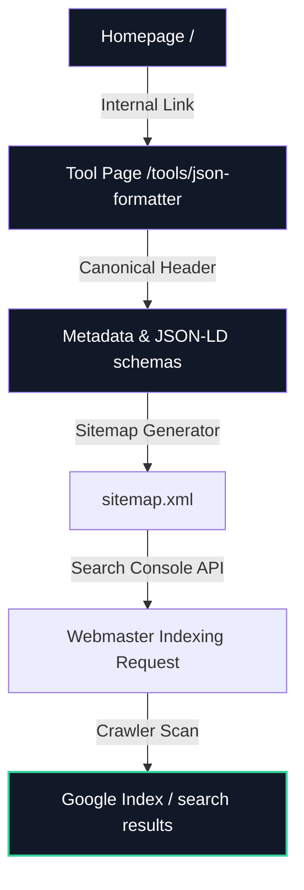

# Architecture Documentation

This document describes the architectural layout, components hierarchy, local processing pipeline, and structural workflows of the grepTools developer suite.

---

## 1. System Overview & Data Flow

grepTools runs entirely client-side. The server serves static files (HTML, CSS, compiled JavaScript, images), and all operational routines are executed locally within the visitor's web browser.

### Data Flow Model (100% Client-Side Processing)

The diagram below details the data flow model. User payloads are never transmitted to server endpoints, keeping user operations secure and private.



---

## 2. Page & Routing Architecture (Next.js App Router)

grepTools leverages Next.js 14 App Router conventions to define static routing boundaries, layout containment, and page metadata schemas.

```text
src/app/
├── layout.tsx                  # Root Layout (Injects global CSS, scripts, cookie banners)
├── globals.css                 # Theme tokens, custom panel interfaces, and utility classes
├── page.tsx                    # Landing Page (Loads Hero, CommandBar, and tool grid)
├── sitemap.ts                  # Static XML sitemap configuration
└── tools/
    ├── page.tsx                # Redirection index page
    ├── base64-encoder/
    │   └── page.tsx            # Base64 routing entry
    ├── json-formatter/
    │   └── page.tsx            # JSON Formatter routing entry
    ├── unix-timestamp-converter/
    │   └── page.tsx            # Epoch Converter routing entry
    ├── url-encoder/
    │   └── page.tsx            # URL Encoder routing entry
    └── uuid-generator/
        └── page.tsx            # UUID Generator routing entry
```

---

## 3. Component Architecture & Layering

Our design abstracts common layouts into shared components, keeping tool logic decoupled from SEO frames and shell templates.

### Component Layer Hierarchy

1.  **Site Frame**:
    *   `SiteHeader` / `Header`: Global headers providing brand visibility and page navigation.
    *   `Footer`: Standard site links and legal compliance declarations.
2.  **Shared Page Wrapper (`ToolShell`)**:
    *   Provides standard typography, titles, description paragraphs, and list badges.
    *   Integrates Ad Slots (`AdSlot`), collapsible FAQ blocks (`ToolFAQ`), and internal lists (`RelatedTools`).
3.  **Visual Indicators & Inputs**:
    *   `EditorPanel`: A dual-pane container displaying text states (chars, lines), and layout titles.
    *   `CopyButton`: Standard clipboard triggers showing action feedback.
    *   `ErrorBanner`: Standard warning panel formatting raw JavaScript syntax errors.
4.  **Core Tool Logic Components**:
    *   `JsonFormatter`, `Base64Tool`, `UrlEncoderTool`, `UuidGeneratorTool`, `UnixTimestampTool`. These components are wrapped inside client state triggers (`'use client'`).

---

## 4. Search Engine Optimization (SEO) & Indexing Workflow

grepTools uses a search visibility pipeline where every utility page contains high-relevancy keywords, metadata definitions, canonical urls, and automated search engine sitemap integration.



*   **Canonical Linking**: Prevents duplicate path penalties by pointing indexers back to standard paths.
*   **JSON-LD FAQPage Schema**: Injected directly into tool pages (`dangerouslySetInnerHTML`) to enable rich snippets on Google Search Result pages.
*   **Internal Linking Strategy**: The `RelatedTools` layout module links every tool to its peers, ensuring that search engines can easily crawl the entire suite.

---

## 5. Analytics & Legal Compliance

To ensure compliance with GDPR, CCPA, and global privacy regulations, grepTools implements a **Opt-In Analytics Policy**:

1.  **Default Blocking**: The Google Analytics script is loaded via `AnalyticsLoader.tsx`, but default Consent Mode parameters are set to `denied` for analytics, advertising, and user profiling.
2.  **CookieConsent Banner**: A banner displays on layout mount. If the visitor clicks accept, consent is updated via `gtag('consent', 'update')` and saved locally inside `localStorage`.
3.  **Local Storage Cache**: On subsequent visits, if the approval token is detected, consent is automatically enabled without repeating the consent banner.
